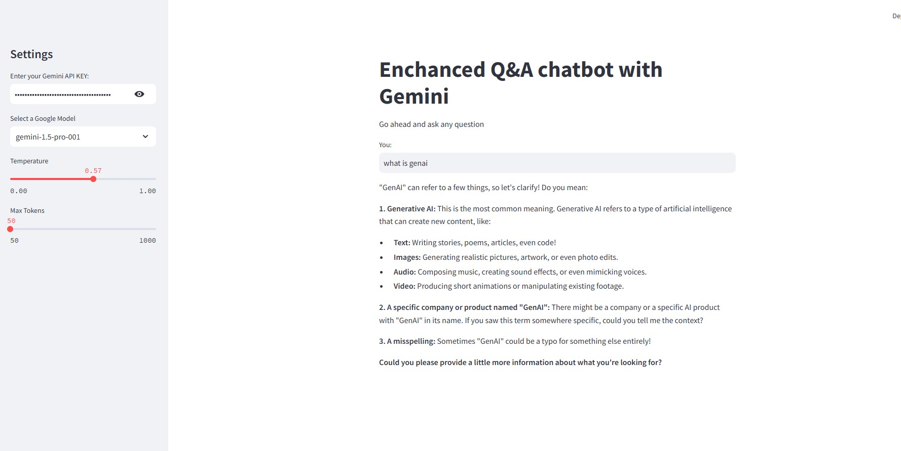

`This is a Streamlit application that uses the Langchain library to create a Q&A chatbot with the Gemini AI model. Here's a breakdown of the code:`

## Importing Libraries

`The code starts by importing the necessary libraries:

- streamlit (st) for building the web application
- langchain_google_genai for interacting with the Gemini AI model
- langchain_core.output_parsers for parsing the output of the model
- langchain_core.prompts for creating a prompt template
os and dotenv for loading environment variables from  a .env file`
## Loading Environment Variables

`The code loads environment variables from a .env file using dotenv. Specifically, it loads the LANGCHAIN_API_KEY, LANGCHAIN_TRACING_V2, and LANGCHAIN_PROJECT variables.`
`
## Prompt Template

`The code defines a prompt template using ChatPromptTemplate.from_messages. The template consists of two messages:

A system message that sets the tone for the conversation: "You are a helpful assistant. Please respond to user queries."
A user message that takes a question as input: "Question: {question}"
`
## Generate Response Function

`The generate_response function takes in the following inputs:

question: the user's question
api_key: the Gemini API key
llm: the Google model to use (e.g., "gemini-1.5-pro-001")
temperature: the temperature parameter for the model (between 0.0 and 1.0)
max_tokens: the maximum number of tokens in the response (between 50 and 1000)
The function uses the GoogleGenerativeAI class to create a model instance, and sets the temperature and max_output_tokens parameters. It then uses the StrOutputParser to parse the output of the model. Finally, it invokes the model with the input question and returns the generated response.
`
## Streamlit App
`
The code creates a Streamlit app with the following components:

Title: "Enhanced Q&A chatbot with Gemini"
Sidebar: for settings
API Key: a text input field for entering the Gemini API key
Model Selection: a dropdown select box for choosing a Google model (e.g., "gemini-1.5-pro-001")
Temperature: a slider for adjusting the temperature parameter (between 0.0 and 1.0)
Max Tokens: a slider for adjusting the maximum number of tokens in the response (between 50 and 1000)
Main Interface: for user input
Text Input: a text input field for entering a question
Response: a text output field that displays the generated response
When the user enters a question and clicks the "Enter" button, the generate_response function is called with the input question and the selected settings. The generated response is then displayed in the response field. If the user hasn't entered a question, a message is displayed prompting them to do so.`
